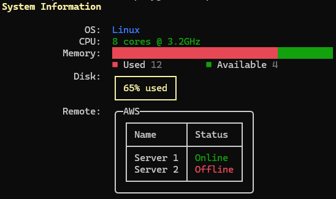

# Spectre.Console Playground

A small collection of standalone C# file-based apps for exploring [Spectre.Console](https://spectreconsole.net/). Each experiment lives in the `experiments` folder and can be run directly with the .NET SDK, without creating a project file.

The examples are intentionally compact: each file focuses on one console UI concept so it is easy to copy, modify, and compare behavior.

## What Is Included

| File | Topic | Demonstrates |
| --- | --- | --- |
| `00-hello.cs` | Text, markup, and color basics | Plain output, formatted values, markup tags, text decorations, named colors, hex colors, and RGB colors |
| `01-progress.cs` | Status and progress | Status spinners and progress bars with simulated work |
| `02-prompt.cs` | Interactive prompts | Free-form text input and selection prompts |
| `03-table.cs` | Tables | Rounded borders, titles, column alignment, rows, and footers |
| `04-exceptions.cs` | Exception rendering | Rich exception formatting and shortened exception output |
| `05-tree.cs` | Trees | Hierarchical tree rendering |
| `06-grid.cs` | Grids and composed renderables | Grid layout, aligned columns, charts, panels, and nested tables |

## Requirements

- [.NET SDK 10 or later](https://dotnet.microsoft.com/download), because the experiments use C# file-based app syntax.
- A terminal that supports ANSI escape sequences for the best colors and formatting.

Each experiment references Spectre.Console directly at the top of the file:

```csharp
#:package Spectre.Console@0.57.0
```

The package is restored automatically when the file is run.

## Getting Started

Clone or download the repository, then run any experiment by passing the `.cs` file to `dotnet run`:

```powershell
cd spectre-console-playground
dotnet run .\experiments\00-hello.cs
```

On macOS or Linux, use forward slashes:

```bash
dotnet run ./experiments/00-hello.cs
```

## Running The Experiments

Run the examples individually:

```powershell
dotnet run .\experiments\00-hello.cs
dotnet run .\experiments\01-progress.cs
dotnet run .\experiments\02-prompt.cs
dotnet run .\experiments\03-table.cs
dotnet run .\experiments\04-exceptions.cs
dotnet run .\experiments\05-tree.cs
dotnet run .\experiments\06-grid.cs
```

Some experiments are interactive:

- `02-prompt.cs` asks for a name and then opens a selection prompt.
- `01-progress.cs` includes short sleeps so the spinner and progress bar are visible.

## Experiment Notes

### Basics

`00-hello.cs` starts with standard console output, then moves into Spectre.Console markup and colors. It is the best place to start if you want to see the difference between `WriteLine`, `MarkupLine`, and writing explicit renderable objects such as `Text` and `Markup`.

### Progress

`01-progress.cs` demonstrates two common long-running task patterns: `AnsiConsole.Status()` for indeterminate work and `AnsiConsole.Progress()` for measurable work.

### Prompts

`02-prompt.cs` shows both text input and a `SelectionPrompt<string>`. This is useful for command-line tools that need lightweight interaction without building a full parser or menu system.

### Tables

`03-table.cs` builds a table with a rounded border, colored title, aligned columns, data rows, and footer totals.

### Exceptions

`04-exceptions.cs` renders nested exceptions twice: once with the default format and once with `ExceptionFormats.ShortenEverything`.

### Trees

`05-tree.cs` builds a simple hierarchy and renders it as a tree.

### Grids

`06-grid.cs` uses a grid as a layout surface and combines multiple Spectre.Console renderables inside it, including a `BreakdownChart`, `Panel`, and nested `Table`.

Example output from `dotnet run .\experiments\06-grid.cs`:



## Troubleshooting

### `Unrecognized directive '#:package'`

Install or select a .NET SDK version that supports C# file-based apps. This repository expects .NET 10 or later.

### Colors or symbols do not render correctly

Use a modern terminal with ANSI support, such as Windows Terminal, VS Code's integrated terminal, iTerm2, or a recent Linux terminal emulator. Some older terminals may show raw escape sequences or simplified output.

## License

This repository is released into the public domain under the [Unlicense](LICENSE).
